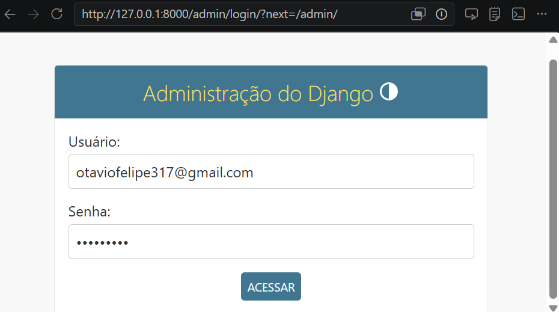
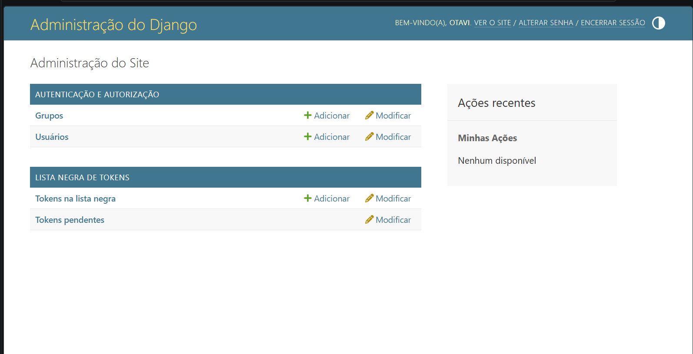
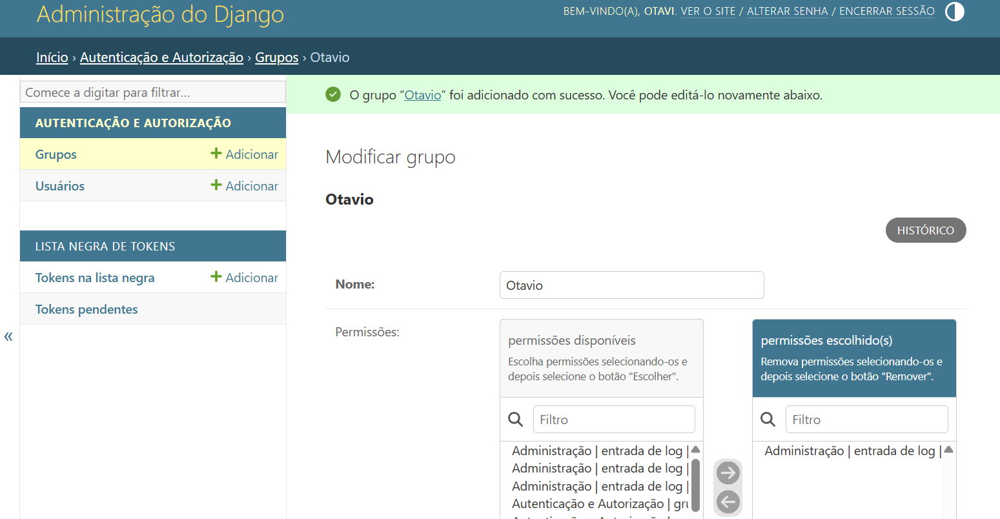
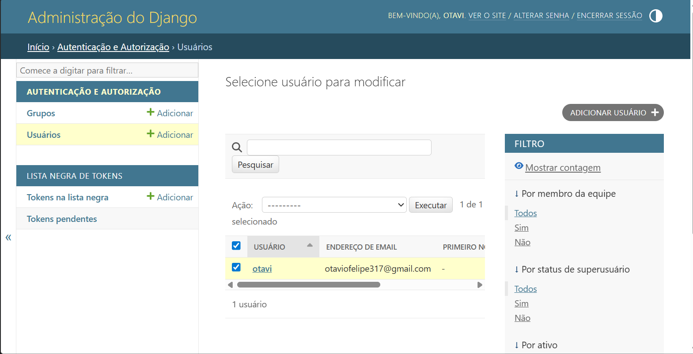
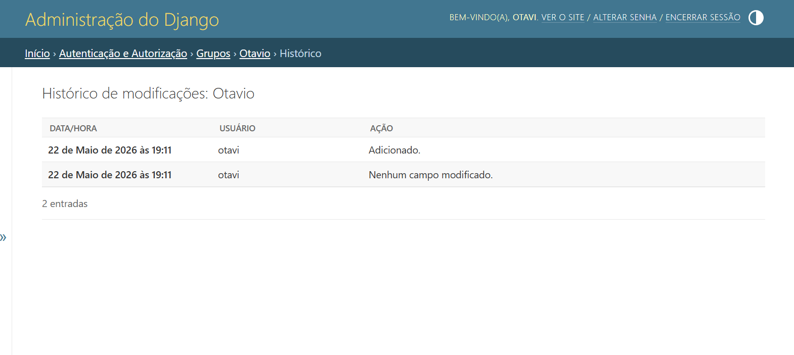

# Personal Journal API

API RESTful desenvolvida com Django REST Framework + JWT.

## Instalação

```bash
python -m venv venv
```

### Ativar ambiente

Windows:

```bash
venv\Scripts\activate
```

Linux/macOS:

```bash
source venv/bin/activate
```

### Instalar dependências

```bash
pip install -r requirements.txt
```

### Rodar migrations

```bash
python manage.py makemigrations
python manage.py migrate
```

### Criar superusuário

```bash
python manage.py createsuperuser
```

### Rodar servidor

```bash
python manage.py runserver
```

## Endpoints

- POST /api/auth/register/
- POST /api/auth/login/
- POST /api/auth/refresh/
- POST /api/auth/logout/
- GET /api/auth/me/
- GET /api/entries/public/
- CRUD /api/entries/

### Imagens 





